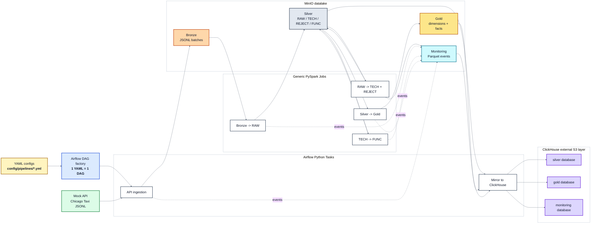

# Generic Chicago Taxi Data Pipeline

Pipeline data engineer locale et reproductible, construite comme un framework generique pilote par YAML. Le projet orchestre une chaine complete `API -> Bronze -> Silver -> Gold -> ClickHouse` avec Airflow, Spark, MinIO et ClickHouse.

Le cas Chicago Taxi sert d'implementation de reference : ajouter un nouveau fichier YAML dans `config/pipelines/` permet de generer automatiquement un nouveau DAG Airflow base sur les memes jobs Spark generiques.

## Architecture



Services locaux :

- Airflow : orchestration et generation automatique des DAGs
- Spark : transformations PySpark generiques
- MinIO : datalake S3-compatible
- ClickHouse : mirroring SQL externe des datasets Parquet
- Mock API : API locale compatible SODA alimentee par une partition JSONL reelle

## Source et Mock API

La source cible est l'API SODA Chicago Taxi. Pendant le developpement, l'API officielle etait souvent lente ou indisponible. Pour rendre le projet reproductible, un mock API local est fourni.

Ce mock n'utilise pas de donnees synthetiques : il sert une partition reelle de 1000 lignes recuperee depuis SODA et stockee dans :

```text
data/raw/chicago_taxi.jsonl
```

Le fichier JSONL est copie dans l'image Docker du mock API. Une autre personne peut donc cloner le projet et lancer directement `docker compose up -d` sans recuperer manuellement la data.

Endpoints :

- Local : <http://localhost:8090/resource/wrvz-psew.json>
- Interne Docker/Airflow : `http://mock-api:8000/resource/wrvz-psew.json`

Parametres supportes pour compatibilite SODA :

- `$limit` : nombre de lignes retournees
- `$offset` : offset de pagination
- `$where` : accepte mais ignore, car la partition est deja preparee

## Prerequis et Lancement Pas a Pas

Prerequis :

- Git 2.40 ou superieur
- Docker Desktop avec moteur Linux
- Docker Compose v2 (`docker compose`)
- Au moins 8 Go de RAM alloues a Docker Desktop et 10 Go d'espace disque libre

1. Cloner le repository et ouvrir le dossier du projet :

```powershell
git clone https://github.com/KhalidElKassimi/chicago-taxi-data-pipeline.git
cd chicago-taxi-data-pipeline
```

2. Optionnel : definir des credentials locaux differents des valeurs par defaut :

```powershell
Copy-Item .env.example .env
```

3. Construire les images locales et demarrer tous les services :

```powershell
docker compose up -d
```

Au premier lancement, la construction de l'image Airflow telecharge PySpark (environ 317 Mo) et peut prendre plusieurs minutes selon la connexion Internet. L'absence temporaire de nouveaux logs pendant ce telechargement ne signifie pas que le build est bloque.

4. Attendre que les services soient demarres puis verifier leur etat :

```powershell
docker compose ps
```

5. Ouvrir Airflow a <http://localhost:8080>, se connecter, puis declencher manuellement le DAG `pipeline_chicago_taxi`.

6. Consulter les resultats dans MinIO ou ClickHouse lorsque le DAG est termine.

Services accessibles apres demarrage :

| Service | URL / Endpoint | Credentials locaux |
| --- | --- | --- |
| Airflow UI | <http://localhost:8080> | `admin` / `admin` |
| Spark Master UI | <http://localhost:8081> | aucun |
| MinIO Console | <http://localhost:9003> | `minioadmin` / `minioadmin` |
| MinIO S3 endpoint | <http://localhost:9002> | `minioadmin` / `minioadmin` |
| ClickHouse HTTP | <http://localhost:8123> | `default` / `clickhouse` |
| ClickHouse native | `localhost:19000` | `default` / `clickhouse` |
| Mock API | <http://localhost:8090/resource/wrvz-psew.json> | aucun |

Verifier la sante des services :

```powershell
docker compose ps
curl.exe http://localhost:8080/health
curl.exe http://localhost:8090/health
```

Ces valeurs peuvent etre surchargees dans `.env` via :

```env
AIRFLOW_ADMIN_USER=admin
AIRFLOW_ADMIN_PASSWORD=admin
AIRFLOW_ADMIN_EMAIL=admin@example.com
MINIO_ROOT_USER=minioadmin
MINIO_ROOT_PASSWORD=minioadmin
CLICKHOUSE_USER=default
CLICKHOUSE_PASSWORD=clickhouse
```

Le fichier `.env` est ignore par Git.

## Structure du Projet

```text
config/pipelines/                  Contrats YAML des pipelines
  chicago_taxi.yml                 Configuration complete du cas Chicago Taxi

dags/
  generic_pipeline_factory.py      Genere un DAG Airflow par fichier YAML

framework/
  config.py                        Charge et valide le contrat YAML
  source_connectors.py             Ingestion API vers Bronze + monitoring Bronze
  layer_transitions.py             Transitions Bronze/Silver/Gold en PySpark
  clickhouse_mirror.py             Cree les tables externes S3 dans ClickHouse

spark_jobs/
  bronze_to_raw.py                 Entry point Spark Bronze -> Silver RAW
  raw_to_tech.py                   Entry point Spark RAW -> TECH/REJECT
  tech_to_func.py                  Entry point Spark TECH -> FUNC
  silver_to_gold.py                Entry point Spark Silver FUNC -> Gold

docker/
  airflow/Dockerfile               Image Airflow avec Spark submit et dependances
  spark/Dockerfile                 Image Spark standalone
  mock-api/                        API locale servant la partition JSONL

data/raw/chicago_taxi.jsonl        Partition source embarquee dans le mock API
docker-compose.yml                 Stack local complet
.env.example                       Variables locales surchargeables
```

Fonctions principales par fichier :

`dags/generic_pipeline_factory.py`

- `load_pipeline_config` : lit un fichier YAML pour generer un DAG.
- `build_pipeline_dag` : construit le DAG Airflow complet pour une pipeline.

`framework/config.py`

- `load_pipeline_config` : charge le YAML et valide les sections obligatoires.

`framework/source_connectors.py`

- `_build_api_params` : construit les parametres SODA (`$where`, `$limit`, `$offset`).
- `_monitoring_event_data` : normalise le schema d'un evenement monitoring Bronze.
- `_write_monitoring_event` : ecrit les evenements Bronze en Parquet.
- `ingest_api_to_bronze_from_source` : appelle l'API, pagine les resultats et ecrit le JSONL Bronze.

`framework/layer_transitions.py`

- `latest_partition_value` : retrouve le dernier batch `ingestion_timestamp` disponible.
- `transition_bronze_to_raw` : lit le dernier batch Bronze et l'ajoute en RAW Parquet.
- `apply_technical_rules` : applique les casts, null checks, ranges et accepted values.
- `transition_raw_to_tech` : separe les lignes valides vers TECH et invalides vers REJECT.
- `apply_func_columns` : selectionne et renomme les colonnes FUNC depuis le YAML.
- `apply_custom_commands` : applique les expressions Spark SQL et les agregats configures.
- `apply_func_dedup` : gere la dedup FUNC en mode `snapshot` ou `history`.
- `transition_tech_to_func` : construit la couche Silver FUNC.
- `build_gold_dimension` : construit les dimensions Gold avec SCD 1 ou SCD 2.
- `build_gold_fact` : construit les facts Gold et joint les surrogate keys des dimensions.
- `transition_silver_to_gold` : ecrit toutes les dimensions et facts Gold.

`framework/clickhouse_mirror.py`

- `_safe_identifier` : normalise les noms YAML en identifiants ClickHouse valides.
- `_has_parquet` : verifie qu'un dossier MinIO contient des fichiers Parquet.
- `_mirror_table` : cree une table ClickHouse externe `ENGINE = S3`.
- `mirror_pipeline_to_clickhouse` : cree automatiquement les bases et tables externes S3.

`spark_jobs/*.py`

- `main` : parse `--config`, cree une `SparkSession`, appelle la transition framework correspondante, puis ferme Spark.

Le DAG genere pour `chicago_taxi.yml` est :

```text
pipeline_chicago_taxi
  ingest_api_to_bronze
  -> bronze_to_raw
  -> raw_to_tech
  -> tech_to_func
  -> silver_to_gold
  -> mirror_to_clickhouse
```

## Configuration YAML

Le pipeline est pilote par `config/pipelines/chicago_taxi.yml`.

La configuration decrit :

- la source API et la pagination
- la couche Bronze
- les sous-couches Silver : `raw`, `tech`, `func`
- les controles qualite TECH et la couche REJECT
- les transformations fonctionnelles FUNC
- les dimensions et facts Gold
- les tables a exposer dans ClickHouse

Principe attendu :

```text
1 fichier YAML = 1 DAG Airflow genere automatiquement
```

Champs principaux du YAML :

`pipeline`

- `name` : nom logique de la pipeline. Il sert a creer le DAG `pipeline_<name>` et les chemins par sujet.

`source`

- `type` : type de source. Valeur implementee dans ce test : `api`.
- `provider` : dialecte de la source. Valeur implementee dans ce test : `soda`.
- `endpoint` : URL appelee par l'ingestion Bronze.
- `filter.column` : colonne utilisee pour filtrer temporellement la source.
- `filter.start` / `filter.end` : bornes de filtre envoyees dans `$where`.
- `pagination.page_size` : taille d'une page API.
- `pagination.max_rows` : nombre maximum de lignes a ingerer.
- `pagination.request_timeout_seconds` : timeout HTTP.
- `pagination.max_retries` : nombre de retries sur erreurs transitoires.

Le design YAML permet d'etendre le framework vers d'autres sources :

- `api` : source HTTP paginee, par exemple SODA.
- `events` : source evenementielle, par exemple Kafka, Event Hubs ou fichiers d'evenements append-only.
- `table` : source relationnelle, par exemple PostgreSQL, SQL Server ou ClickHouse.
- `file` : source fichier, par exemple CSV, JSONL ou Parquet depose dans un bucket.

Exemples de champs possibles selon le type :

- `api` : `endpoint`, `provider`, `filter`, `pagination`.
- `events` : `broker`, `topic`, `consumer_group`, `starting_offsets`.
- `table` : `connection`, `schema`, `table`, `incremental_column`.
- `file` : `bucket`, `prefix`, `format`, `schema_mode`.

`bronze`

- `bucket` : bucket MinIO cible.
- `prefix` : chemin Bronze dans le datalake.
- `format` : format de stockage. Valeur utilisee : `jsonl`.

`monitoring`

- `bucket` : bucket MinIO pour les evenements.
- `prefix` : chemin monitoring.
- `format` : format de stockage. Valeur utilisee : `parquet`.

`silver.raw`

- `table_name` : nom logique de table RAW.
- `source_table` : couche source logique.
- `bucket` / `prefix` / `format` : stockage RAW.
- `columns[].name` : nom de colonne attendu.
- `columns[].type` : type declare au niveau RAW. Valeur utilisee : `string`.

`silver.tech`

- `columns[].type` : type Spark cible (`string`, `timestamp`, `double`, `integer`).
- `check_nullability` : active le controle de null.
- `is_critical` : si `true`, une valeur null/vide envoie la ligne dans REJECT.
- `check_range.min` / `check_range.max` : bornes autorisees pour les valeurs numeriques.
- `fill_nulls` : valeur de remplacement pour les nulls non critiques.
- `accepted_values` : liste de valeurs autorisees pour une colonne categorical.

`silver.func`

- `columns[].source` : colonne source venant de TECH.
- `columns[].name` : nom cible dans FUNC.
- `transformations[].type` : type de transformation. Valeur supportee : `expression`.
- `transformations[].expression` : expression Spark SQL appliquee ligne par ligne.
- `enrichments[].type` : type d'enrichissement. Valeur supportee : `aggregate`.
- `enrichments[].group_by` : colonnes de regroupement.
- `enrichments[].metrics[].function` : fonction d'agregat (`count`, `sum`, `avg`, `min`, `max`).
- `deduplication.strategy` : `snapshot` ou `history`.
- `deduplication.keys` : cle metier de deduplication.
- `deduplication.order_by` : colonne utilisee pour garder la derniere valeur.

`gold`

- `dimensions[]` : dimensions analytiques a produire.
- `dimensions[].business_key` : cle metier de la dimension.
- `dimensions[].surrogate_key` : cle technique generee.
- `dimensions[].columns` : colonnes conservees dans la dimension.
- `dimensions[].scd.type` : `1` ou `2`.
- `dimensions[].scd.valid_from` : date de debut de validite pour SCD 2.
- `dimensions[].scd.tracked_columns` : colonnes qui changent le `hash_data` SCD 2.
- `facts[]` : tables de faits a produire.
- `facts[].grain` : grain fonctionnel de la fact.
- `facts[].columns` : colonnes et mesures conservees.
- `facts[].joins` : jointures vers les dimensions pour recuperer les surrogate keys.

## Datalake

MinIO expose le bucket `datalake`.

Organisation par sujet puis par couche :

```text
datalake/
  chicago_taxi/
    bronze/
    silver/
      raw/
      tech/
      reject/
      func/
    gold/
      dimensions/
      facts/
    monitoring/
```

RAW, TECH et REJECT sont append-only et partitionnes par batch :

```text
ingestion_timestamp=YYYYMMDDTHHMMSSZ
```

Chaque transition lit uniquement le dernier batch disponible de la couche precedente. Cela evite de retraiter tout l'historique Bronze a chaque execution.

## Silver

La couche Silver est decoupee en trois sous-couches fonctionnelles :

- `raw` : conserve les donnees issues de Bronze en Parquet, sans transformation metier. Elle sert de zone technique structurée et rejouable.
- `tech` : applique les casts, controles techniques et normalisations. Elle contient uniquement les lignes valides et typees.
- `func` : prepare un dataset metier exploitable par Gold, avec renommage de colonnes, colonnes derivees, agregats et deduplication.

La couche `reject` est produite en parallele de `tech`. Elle contient les lignes qui ne respectent pas les controles qualite, avec les champs rejetes et la raison du rejet.

## Qualite et REJECT

La couche TECH applique des controles generiques :

- cast de types
- nullabilite critique
- bornes min/max
- valeurs acceptees
- normalisation des chaines vides en null

Les lignes invalides sont ecrites dans `silver/reject` avec :

```text
rejected_fields
rejection_reason
rejection_stage
rejected_at
```

Les raisons de rejet suivent un format lisible :

```text
field=fare; check=unexpected_value; reason=below_minimum
field=trip_id; check=unexpected_null; reason=required_field_missing
```

## Silver FUNC

La couche FUNC transforme les donnees TECH en dataset metier :

- projection et renommage des 23 colonnes source
- colonnes derivees via expressions Spark SQL
- enrichissements par agregats
- deduplication `snapshot` ou `history`

En mode `snapshot`, FUNC garde la derniere version par cle metier.

En mode `history`, FUNC genere `hash_data` et conserve les versions distinctes.

## Gold

Gold construit un modele analytique :

- dimensions
- facts
- jointures fact vers dimensions
- SCD Type 1
- SCD Type 2

Dimensions actuelles :

- `dim_company` : SCD 2
- `dim_taxi` : SCD 2
- `dim_payment_type` : SCD 1
- `dim_community_area` : SCD 1
- `dim_date` : SCD 1

Fact actuelle :

- `fact_taxi_trip`

Pour les dimensions SCD 2, le framework genere :

```text
valid_from
valid_to
is_current
hash_data
```

La version courante a :

```text
is_current = true
valid_to = null
```

Lorsqu'une nouvelle version arrive, l'ancienne version est fermee avec :

```text
valid_to = next_valid_from - 1 microsecond
```

## Monitoring

Le monitoring est stocke en Parquet dans MinIO.

Chemins normalises :

```text
monitoring/bronze/
monitoring/raw/
monitoring/tech/
monitoring/func/
monitoring/gold/dimensions/<dimension_name>/
monitoring/gold/facts/<fact_name>/
```

Scenarios couverts :

- `started`
- `success`
- `no_data`
- `failed`

En cas d'erreur, le monitoring contient :

```text
error_type
error_message
```

## ClickHouse

ClickHouse expose les datasets MinIO via des tables externes `ENGINE = S3`. Les donnees restent physiquement dans MinIO ; ClickHouse les lit directement a chaque requete.

Bases creees automatiquement :

- `silver`
- `gold`
- `monitoring`

Exemples de tables :

```text
silver.raw_chicago_taxi
silver.tech_chicago_taxi
silver.reject_chicago_taxi
silver.func_chicago_taxi_trips

gold.dim_company
gold.dim_taxi
gold.dim_payment_type
gold.dim_community_area
gold.dim_date
gold.fact_taxi_trip

monitoring.raw_events
monitoring.tech_events
monitoring.gold_fact_taxi_trip_events
```

Verifier les tables ClickHouse :

```powershell
docker compose exec clickhouse clickhouse-client --user default --password clickhouse --query "SELECT database, name, engine FROM system.tables WHERE database IN ('silver','gold','monitoring') ORDER BY database, name"
```

## Commandes Utiles

Lancer tout le stack :

```powershell
docker compose up -d
```

Verifier les services :

```powershell
docker compose ps
```

Tester la pipeline :

Le projet expose un seul DAG applicatif genere depuis le YAML :

```text
pipeline_chicago_taxi
```

Il n'est pas planifie automatiquement (`schedule=None`). Pour tester la chaine complete, ouvrir l'UI Airflow, chercher `pipeline_chicago_taxi`, puis cliquer sur le bouton de declenchement manuel.

Le DAG execute ensuite les etapes dans l'ordre :

```text
ingest_api_to_bronze
-> bronze_to_raw
-> raw_to_tech
-> tech_to_func
-> silver_to_gold
-> mirror_to_clickhouse
```


## Configuration Locale

Les credentials par defaut sont destines au developpement local uniquement.

Ils peuvent etre surcharges via `.env` :

```env
AIRFLOW_DB_USER=airflow
AIRFLOW_DB_PASSWORD=airflow
AIRFLOW_DB_NAME=airflow
AIRFLOW_ADMIN_USER=admin
AIRFLOW_ADMIN_PASSWORD=admin
AIRFLOW_ADMIN_EMAIL=admin@example.com

MINIO_ROOT_USER=minioadmin
MINIO_ROOT_PASSWORD=minioadmin

CLICKHOUSE_USER=default
CLICKHOUSE_PASSWORD=clickhouse
```

Le fichier `.env` ne doit pas etre commite.

## Choix Techniques et Arbitrages

- **Airflow + YAML** : un fichier YAML produit un DAG et reutilise les memes jobs Spark. Cela privilegie la standardisation et l'ajout rapide de nouveaux sujets plutot que des DAGs sur mesure.
- **Spark standalone local** : un cluster Spark Docker isole les transformations du conteneur Airflow. C'est plus proche d'une architecture de production qu'un traitement Python embarque, au prix de ressources locales plus importantes.
- **MinIO** : son API S3 permet une organisation Bronze/Silver/Gold locale, portable et compatible avec les patterns cloud, sans dependance a un compte cloud.
- **Mock API avec donnees reelles** : le mock sert une partition SODA versionnee dans le repository. Ce choix rend le test reproductible quand l'API publique est lente ou indisponible ; en contrepartie, le volume et la fraicheur des donnees sont limites.
- **RAW, TECH et REJECT append-only** : chaque batch est tracable et rejouable. FUNC utilise un snapshot deduplique pour fournir une vue metier courante plus simple a consommer.
- **Gold en overwrite depuis FUNC** : ce choix maintient un modele analytique coherent et simple pour ce test technique. Une approche incrementale serait preferable sur de gros volumes.
- **ClickHouse `ENGINE = S3`** : ClickHouse lit directement les fichiers Parquet MinIO, sans dupliquer les donnees. Cela offre un vrai mirroring mais les performances dependent de l'acces objet et ne beneficient pas d'index ClickHouse locaux.

## Ce Que Je Ferais Avec Plus de Temps

- Mettre en place une CI/CD GitHub Actions. Exemple simple : a chaque pull request, executer `docker compose config --quiet`, construire les images et lancer les tests unitaires ; apres merge sur `main`, publier les images versionnees dans un registry puis deployer la configuration vers l'environnement cible.
- Ajouter le support multi-source dans le YAML, par exemple plusieurs API, fichiers ou tables pour un meme sujet fonctionnel.
- Gerer le multi-source dans Silver avec une sous-couche RAW par source, puis une consolidation TECH/FUNC commune.
- Ajouter une logique de soft delete dans Gold avec des champs comme `is_deleted`, `deleted_at` et `delete_reason` pour conserver l'historique analytique sans supprimer physiquement les lignes.
- Enrichir le monitoring avec un systeme d'alerting mail en cas de `status=failed`, afin d'envoyer automatiquement le layer, la table, le batch, le type d'erreur et le message d'erreur.
